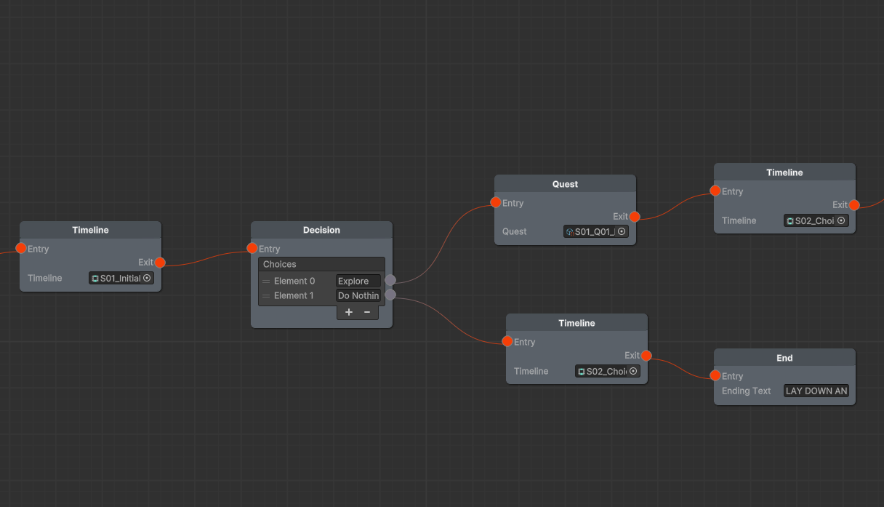

# DemoBranchingLogic

This Unity project demonstrates a visual branching narrative system using a custom decision tree built with the [xNode](https://github.com/Siccity/xNode) library. It allows for the creation of interactive storytelling with multiple paths, player choices, and a modular quest system.

## Core Features

The main logic is located in `Assets/Scripts/DecisionTree` and includes a node-based editor with the following node types:

- **Root**: The entry point of the graph.
- **Timeline**: Plays a Unity Timeline sequence and proceeds to the next node.
- **Decision**: Displays a choice screen with text options; each option connects to a different path.
- **Quest**: Starts a quest that must be completed to continue. Currently supports "Reach The Point" quests, with support for easy extension.
- **End**: Terminates the graph and displays a customizable ending message.

## Quest System

Located in `Assets/Scripts/Quests`, the quest system is designed to be extensible and currently supports:

- Defining quests through `QuestInfo` assets (ScriptableObjects).
- Creating quest items that act as triggers or contain logic for quest completion.
- Managing quests dynamically via a `QuestManager` that instantiates quests from `QuestInfo` data.

## Additional Components

- A working character controller with a dedicated animator.
- Scene management using multiple Unity scenes to share common gameplay objects.
- Basic UI and menus with animated transitions using DOTween.

## Demo Video

## Node Tree Screenshot

## Dependencies

This project uses the following third-party Unity assets:

- [DOTween](http://dotween.demigiant.com/) – for UI and object animations
- [Cinemachine](https://unity.com/unity/features/editor/art-and-design/cinemachine) – for camera control
- [FMOD](https://www.fmod.com/) – for audio management
- [xNode](https://github.com/Siccity/xNode) – for building the visual node editor